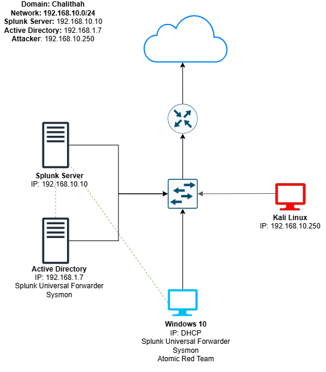

# 🛡️ Active Directory Lab with Splunk, Sysmon & Kali Linux

This project is a full lab environment that simulates an enterprise setup with Active Directory, Windows clients, Splunk SIEM, Sysmon for logging, and Kali Linux for red team attacks.

## 📌 Architecture Diagram

This lab simulates a real-world enterprise setup with:
Components:
- **Active Directory** (Windows Server 2022)
- **Domain-joined Windows 10 client**
- **Splunk on Ubuntu Server** for log aggregation and detection
- **Sysmon** for detailed host telemetry
- **Kali Linux** to simulate brute-force and adversary techniques

## ⚙️ Lab Components

| Component        | Purpose                           |
|------------------|-----------------------------------|
| Windows Server 2022 | AD Domain Controller         |
| Windows 10          | Domain-joined endpoint        |
| Kali Linux           | Red team simulation (brute force, etc.) |
| Splunk (Ubuntu)      | SIEM for log aggregation      |
| Sysmon               | Host telemetry on both Windows machines |
| Atomic Red Team      | Simulated attacker techniques |
| VirtualBox           | All VMs hosted locally        |

---

## 🚀 Setup Guide

### 1️⃣ Provision VMs
Install the following in VirtualBox:
- Windows Server 2022
- Windows 10
- Ubuntu Server (Splunk)
- Kali Linux

### 2️⃣ Configure Active Directory
- Promote Windows Server to a domain controller
- Create domain users
- Join Windows 10 machine to the domain

### 3️⃣ Install Sysmon
- Install Sysmon with a custom config on both Windows machines
- Recommended config: [SwiftOnSecurity/sysmon-config](https://github.com/SwiftOnSecurity/sysmon-config)

### 4️⃣ Install and Configure Splunk
- Install Universal Forwarder on both Windows machines
- Send logs (Security, Sysmon, Application) to Splunk on Ubuntu
- Verify log ingestion

### 5️⃣ Simulate Attacks
- Use Kali Linux to launch brute-force attacks on domain users
- Use [Atomic Red Team](https://github.com/redcanaryco/atomic-red-team) for simulated TTPs
- Monitor telemetry in Splunk

---

## 📊 Detection & Analysis

Detected via Splunk:
- Failed logins and account lockouts
- Suspicious PowerShell usage
- Privilege escalation attempts
- Lateral movement indicators

> _Example Splunk queries and dashboards coming soon!_

---

## 💡 What I Learned

- Hands-on Active Directory setup and domain configuration
- Using Sysmon for granular telemetry collection
- Forwarding logs to Splunk and building detection use cases
- Red team simulation and blue team response in a home lab

---

## 📸 Screenshots

> Add screenshots of:
- Domain setup
- Brute-force alerts
- Splunk dashboards

---

## 🔮 Future Work

- [ ] Build Splunk dashboards and alerts
- [ ] Map Atomic Red Team tests to MITRE ATT&CK
- [ ] Add detection queries for each attack

---

## 📚 References

- [YouTube Series (Start Here)](https://youtu.be/5OessbOgyEo)
- [Atomic Red Team](https://github.com/redcanaryco/atomic-red-team)
- [Sysmon Config](https://github.com/SwiftOnSecurity/sysmon-config)
- [Splunk Free Training](https://www.splunk.com/en_us/training.html)
